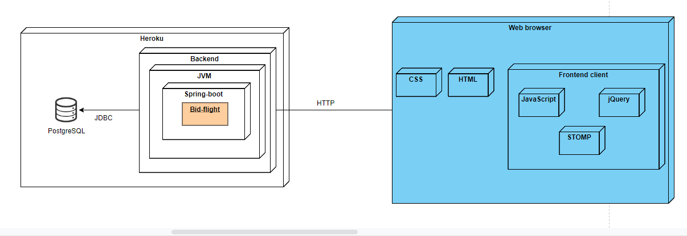

# Bid flight

Proyecto para la asignatura de Arquitectura de software de la Escuela colombiana de ingeniería Julio Garavito.

--- 
### Problema a solucionar

Se suele presentar el caso de que en algunos vuelos quedan asientos vacíos ya sea por cancelación o por llegadas tarde por parte del cliente, o no se lograron vender suficientes asientos para llenar el avión, es por ello que actualmente las aerolíneas venden más boletas que asientos en el avión, en busca de evitar dicha situación, aun así, se basa en modelos predictivos que aún no están perfeccionados y se dan casos en los que aún quedan puestos vacíos. 

Las soluciones actuales como despegar.com o skyscanner.com cuentan con funciones en el concepto de "last minute flights" cuyo objetivo es llenar el avión de alguna manera cuando esta pronto a despegar, sin embargo, tiene la desventaja que al ser enfocada a vuelos en general y se pierde el enfoque de estos vuelos de último momento, lo cual tiende a confundir al usuario por la falta de una clara exposición de la información. 

---
### Descripción

Nuestra aplicación busca proveer este servicio de "last minute flights" con la particularidad de que las aerolíneas tienen la oportunidad de subastar estos asientos vacíos, para que los usuarios tengan la oportunidad de acceder a dichos vuelos, el objetivo es que dichas subastas inicien con una puja baja para que sea atractiva para el usuario.

Nuestra aplicación busca que en temporadas altas al haber alto flujo de usuarios en busca de vuelos las pujas suban y generen beneficios a las aerolíneas mientras le da a la oportunidad a los usuarios de obtener los vuelos que tanto desean, sin embargo no solo beneficia a las aerolíneas en términos financieros pues en temporadas bajas se espera que las pujas se mantengan bajas y los usuario puedan conseguir los vuelos más baratos que lo usual.

---
### Arquitectura

En este caso nuestra aplicación se encuentra diseñada para funcionar en base al framework Spring-boot, además de esto, su despliegue se encuentra sobre la plataforma Heroku.

A continuación, mostramos algunos de los modelos usados dentro de esta aplicación.

#### Diagrama de datos

#### Diagrama de componentes

#### Diagrama de despliegue

---
### Guía de uso

### Guía de usuario
Nuestra aplicación cuenta con una interfaz sencilla, que provee todos los elementos necesarios para su comprensión. Sin embargo, aquí mostramos lo principal para el uso de nuestra aplicación siendo un usuario.

##### Registro de usuario
Lo primero para tener en cuenta será el registro de un nuevo usuario. 
En nuestro menú en la parte superior a la derecha se ve la opción de "Sign up". Una vez le das clic te lleva al siguiente formulario, el cual permite la creación de cuentas.

##### Ingreso de usuario
Nuevamente en la sección superior se puede ver la opción "Log in", la cual te llevará al siguiente formulario, donde tras ingresar los datos solicitados podrás acceder al sistema.

##### Página de subastas
Una vez el usuario este dentro del sistema, lo que verá será la siguiente página.

En dicha vista puedes hacer varias cosas como añadir saldo, pujar, filtrar, entre otras. Para algunas de estas funciones mostramos el siguiente ejemplo:

### Guía para aerolíneas

Una vez explicado el funcionamiento básico de la plataforma para los usuarios vale la pena explicar como funciona (de manera visual) para su contraparte, en este caso las aerolíneas.

Lo primero entonces es ver la sección que da acceso a las aerolíneas, en la parte superior se ve la pestaña "Airlines", la cual te lleva a la siguiente vista.

##### Registro para aerolíneas

Como se ve en la página principal de las aerolíneas, se permite el ingreso y el registro de las mismas. En este caso si vamos al apartado de registro veremos lo siguiente:

Una vez llenos estos datos, saldrá una confirmación brindando un poco de información extra. Dicha confirmación nos indica que para las aerolíneas el proceso de registro debe pasar por un intermediario que lo valide.

##### Ingreso de aerolínea

Una vez se cuente con la información de acceso para la aerolínea se permite el ingreso a través de la sección "Log in" de la página principal de Airlines. Sin embargo, para este prototipo no se cuenta realmente con una confirmación del registro, dicho esto, cuando intentes ingresar solo debes hacerlo con una aerolínea existente, sin tener en cuenta el campo de la contraseña. Esto se hizo simplemente porque dicha sección no era el foco central de este proyecto, además, consideramos que dicha sección se sale del alcance de este proyecto.

#### Página principal de las aerolíneas

Cuando hayamos ingresado como aerolínea, nos llevará a una sección donde en el centro, se muestra una lista de las subastas actualmente activas relacionadas a la aerolínea. Y en la parte superior central podemos ver unos campos que nos permiten la publicación de vuelos, con tiquetes libres. Los cuales, a su vez, harán la publicación automática de subastas por cada tiquete que haya sido publicado.

## Atributos no funcionales

#### Disponibilidad

Nuestro ratios de disponibilidad por año: 6.278538812% 

Tiempo inactivo por año: 8210h 

Después de 30min de inactividad Heroku pone a dormir a la aplicación por lo que esto afecta a la disponibilidad también, sin embargo, al volver a hacer una solicitud al servicio este se reanudara hasta que vuelvan a haber 30 min de inactividad

#### Usabilidad

85.71% de efectividad, esto se midió con respecto a cuantas tareas daban feedback de su realización

Heurísticas:

•	Visibilidad del estado del sistema
El sistema de real-time provee retroalimentación instantánea a los usuarios de sus interacciones y las de otros, mostrando información clara, que le permite saber el estado de la subasta

•	La coincidencia entre el sistema y el mundo real
19 de las 21 interacciones con el sistema usamos lenguaje común

•	Control y libertad del usuario
Solo las secciones de registro (2) no permiten al usuario la libertad para acceder de manera inmediata a otros recursos

•	Consistencia y estándares
Los usuarios no deberían tener que preguntarse si diferentes palabras, situaciones o acciones significan lo mismo. Siga las convenciones de la plataforma.

•	Reconocer en lugar de recordar
Para el usuario es fácil acceder a las subastas ya sea activas o no debido a nuestra barra de búsqueda, no es así para las aerolíneas, pues ellas solo ven todas sus subastas y no tienen manera de filtrar

•	Flexibilidad y eficiencia de uso
Solventamos la carga de usuario con llamados asíncronos pues aun si esta consultando los datos de sesión puede estar cargando las subastas al mismo tiempo

•	Diseño estético y minimalista
Nuestro diseño es simple y conciso solo le muestra al usuario lo que necesita saber

•	Ayudar a los usuarios a reconocer, diagnosticar y recuperarse de los errores
Aquí pecamos pues la retroalimentación de los errores la hacemos a partir de alertas entendemos que ese es un punto por mejorar

•	Ayuda y documentación
Aunque es mejor si el sistema puede utilizarse sin documentación, puede ser necesario proporcionar ayuda y documentación. Esa información debe ser fácil de buscar, centrarse en la tarea del usuario, enumerar los pasos concretos que deben realizarse y no ser demasiado amplia.

---
#### Autores
- Michael Preciado 
- Jeymar Vega 
